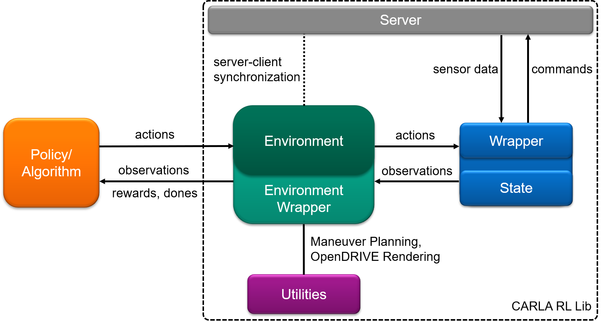

# CARLA Reinforcement Learning Library

This library follows the basic principles of an openai gym environment and supports reinforcement learning with the CARLA Simulator.
It runs with CARLA 0.9.7 and python 2.7/3.6.
Later versions are not tested.

To get started with CARLA, click
[here](https://carla.org/).

## Installation

1\. Clone this repository to your local machine:

```bash
git clone https://github.com/50sven/carla_rllib.git
```

2\. Install the carla_rllib package and the required site-packages (in your virtual environment):

```bash
cd carla_rllib
pip install .
```

**Note:** Changes to the code must be made in the site-package to be effective. Alternatively, you may install the carla_rllib using a PYTHONPATH to work directly with the repository clone.

3\. If not yet done, install the carla module (in your virtual environment):

```bash
export CARLA_ROOT=path/to/carla/root_folder/
easy_install ${CARLA_ROOT}/PythonAPI/carla/dist/carla-<VERSION>-<PYTHON>-linux-x86_64.egg
```
**Note:** Choose the installed CARLA VERSION (0.9.6, 0.9.7, ...), and choose the PYTHON interpreter (py2.7 or py3.5). Python 3.5 egg also works for python 3.6.


## Get Started

The carla_rllib provides four examples. For some tests it is necessary to adapt the configuration file 'config.json'.

- run [`carla_env_test.py`](carla_rllib/examples/carla_env_test.py) to test single- or multi-agent settings without policies
- run [`carla_env_reward_fun_test.py`](carla_rllib/examples/carla_env_reward_fun_test.py) to test your reward functions
- run [`carla_env_baselines_test.py`](carla_rllib/examples/carla_env_baselines_test.py) to test or train with stable baselines
- run [`carla_env_trajectory_test.py`](carla_rllib/examples/carla_env_trajectory_test.py) to test multi-agent environments with discrete trajectory tracing (tailored for former master thesis)


## Structure





#### Environment:

- implements the gym interface and contains all the necessary functionality to run an agent
- further functionality may be added with gym.Wrappers
- supports [stable baselines](https://stable-baselines.readthedocs.io/en/master/) (single agent only; requires python3 (>=3.5))
- synchronizes server and client by executing timesteps (ticks) in the simulation


#### CARLA Wrapper:

- implements a communication channel between server and client (each agent has its own wrapper)
- communicates actions to the server and has access to the entire simulation data
- supports basic steer and throttle control as well as discrete actions (transformation/teleportation)
- leverages gpu-based sensors (images) and cpu-based sensors (collision, lane invasion, ...)
- calculates additional data on client side and summarizes the entire state for an agent


#### Utilities:

- provides further functionality
    - spectator: enables to spectate an agent
    - trajectory planning: enables short-term maneuver planning based one jerk minimization (tailored for former master thesis)
    - OPENDRIVE rendering: enables top-view rendering in no-rendering mode (tailored for former master thesis)
    - ... and more


## How to use?


In order to fit your learning goals a few things may need to be adjusted. Here are the essential parts to have a look at. If you make changes to the code and you don't work with PYTHONPATH, remember to reinstall the package with pip or make your implementations directly in the installed site-package of your virtual environment.

#### Configuration: [`config.json`](carla_rllib/config.json)
- configures crucial environment settings
- carla_server:
    - environments only work properly in synchronous mode
    - delta seconds define the time between consecutive simulation frames
    - no rendering mode disables rendering and Unreal Engine will skip everything related to graphics
- environment:
    - reset information defines scenarios comprising the initial state distributions of agents and obstacles
    - cooperation factor allows to use a cooperative reward function in multi-agent settings
    - frame skipping allows to perform actions more than once (rewards are accumulated)
    - rendering enables a spectation window (see spectators.py in utils for independent spectation)
    - stable baselines creates gym.Spaces for actions and observations (stable baselines only for with single agent setups)
- agent:
    - choose your agent type (continuous, steering, discrete)
    - choose your camera settings (rgb, segmentation, depth)

#### Environment: [`base_env.py`](carla_rllib/environments/carla_envs/base_env.py)
- defines the basic gym functionalities for a single agent environment (step, reset render)
- multi-agent functionality, obstacles, frame skipping and stable baseline support (gym.Space) are excluded in gym.Wrappers ([`env_wrapper.py`](carla_rllib/environments/carla_envs/env_wrapper.py))
- adjust the class methods to your needs (mostly [`get_obs()`](https://github.com/50sven/carla_rllib/-/blob/master/carla_rllib/environments/carla_envs/base_env.py#L284) and [`get_reward()`](https://github.com/50sven/carla_rllib/-/blob/master/carla_rllib/environments/carla_envs/base_env.py#L293))
- adjust the action/observation space in [`SpaceWrapper`](https://github.com/50sven/carla_rllib/-/blob/master/carla_rllib/environments/carla_envs/env_wrapper.py#L135) to enable learning with stable baselines if necessary

#### Carla Wrapper: [`wrappers.py`](carla_rllib/carla_wrapper/wrappers.py)
- use one of the provided wrappers or build your own wrapper with individual action control
- add more sensors to [`sensors.py`](carla_rllib/carla_wrapper/sensors.py) and use them in the wrapper, if necessary

#### States: [`states.py`](carla_rllib/carla_wrapper/states.py)
- stores the entire state data which is extendable
- always adjust [`_get_sensor_data()`](https://github.com/50sven/carla_rllib/carla_wrapper/wrappers.py#L161) or [`_get_non_sensor_data()`](https://github.com/50sven/carla_rllib/-/blob/master/carla_rllib/carla_wrapper/wrappers.py#L171) of the wrapper

#### Utils:
- [`spectators.py`](carla_rllib/utils/spectators.py) provides a spectator class to observe/control (headless) training runs
- [`rendering.py`](carla_rllib/utils/rendering.py) provides functionality to render the underlying OpenDrive maps
- [`reward_functions.py`](carla_rllib/utils/reward_functions.py) provides examples of reward functions
- [`trajectory_planning.py`](carla_rllib/utils/trajectory_planning.py) provides an polynomial trajectory generator based on jerk minimization


#### Remarks:

- Run environments like a gym environment and always use **try-finally blocks** to properly destroy the carla actors (see example files):

```python
import ...

env = make env

try:

    training loop

finally:

    clear server

```
- always adjust the environment configuration in [`config.json`](carla_rllib/config.json) to change fundamental settings
- if you want to use stable baselines there might be a SyntaxError in tensorflow 1.14.0; uncomment the line
`from tensorflow.contrib.image.python.ops.single_image_random_dot_stereograms import single_image_random_dot_stereograms` seems to fix it
- the (discrete) trajectory environment and the OpenDrive rendering are implemented for a specific use case and might be unwieldy to use
